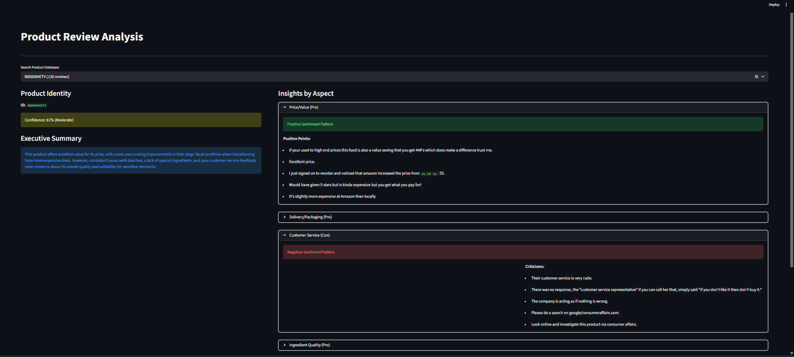

# Product Review Insights API

A high-performance RAG pipeline designed for intelligent product review analysis. Built with **Hybrid Clustering**, **LLM-based Aspect Extraction**, and **Vector Similarity Search**, this project transforms raw customer feedback into structured, actionable intelligence.

[](https://www.python.org/)
[](https://fastapi.tiangolo.com/)
[](https://streamlit.io/)
[](https://www.trychroma.com/)
[](LICENSE)

This project implements Task 5 from the AI and Programming Hackathon Challenge. It provides a Retrieval-Augmented Generation (RAG) pipeline to extract aspects, sentiment, and supporting evidence from a dataset of Amazon product reviews.

## Implementation Details

The implementation follows the mandatory components specified in the challenge objectives:

1. Text Preprocessing: Reviews are cleaned of HTML tags and normalized. Sentence segmentation is performed using the spaCy en_core_web_sm model to ensure semantic boundaries are respected for the embedding process.
2. Aspect Extraction: A hybrid approach is used. First, K-Means clustering (scikit-learn) groups similar review sentences. Second, an LLM (GPT-4o-mini) analyzes these clusters to identify the top 5-10 distinct aspects.
3. Aspect Sentiment Analysis: Sentiment is calculated based on the metadata ratings (1-5 stars) associated with the retrieved sentences for each aspect. A score between 0.0 and 1.0 is generated based on the ratio of positive to negative reviews.
4. Evidence Selection: Supporting evidence is retrieved using vector similarity search (ChromaDB) with a configurable relevance threshold. All evidence is verbatim from the dataset to prevent hallucination.
5. API Validation: The system uses FastAPI for request handling, input validation, and error management. 

## Application Screenshots

### Dashboard Overview


### Detailed Insight Analysis


### Product Selection and Summary


## Repository Structure
```
product-review-api/
├── main.py                     # Client Gateway API (Proxies requests to RAG Engine)
├── RAG/
│   ├── main.py                 # Core RAG Server (Handles analysis logic)
│   ├── insight_engine.py       # Core Logic (LLM, Sentiment, and Evidence Selection)
│   ├── cluster_aspect_extractor.py # K-Means implementation for theme discovery
│   ├── vector_store.py         # ChromaDB management and sub-batching logic
│   ├── data_manager.py         # spaCy preprocessing and data loading
│   └── index_data.py           # Script to populate the vector database
├── front_end/
│   └── dashboard.py            # Streamlit-based user interface
├── data/
│   └── Clean_reviews.csv       # Preprocessed dataset
├── logs/                       # Server logs (gateway.log and rag_engine.log)
├── requirements.txt            # Project dependencies
└── .env                        # Configuration for OpenRouter API key
```
## Installation and Setup

1. Create and activate a virtual environment (Python 3.12+):
   python -m venv .venv
   source .venv/bin/activate

2. Install dependencies:
   pip install -r requirements.txt
   python -m spacy download en_core_web_sm

3. Configure environment variables:
   Create a .env file in the root directory and add your key:
   OPENROUTER_API_KEY=your_api_key_here

4. Index the dataset:
   python RAG/index_data.py

## Dataset used
https://www.kaggle.com/datasets/saurav9786/amazon-product-reviews

## Running the Application

The system requires two backend servers and one frontend application.

1. Start the RAG Engine (Core Server):
   python -m RAG.main
   (Runs on http://localhost:8000)

2. Start the Gateway API (Client Server):
   python main.py
   (Runs on http://localhost:8001)

3. Start the Dashboard (Frontend):
   streamlit run front_end/dashboard.py

## API Documentation

### 1. Get Product Catalog
Endpoint: GET /products
Returns a dynamic list of all products in the database with their review counts.

### 2. Get Product Insights
Endpoint: GET /items/{item_id}

Sample Request:
curl http://localhost:8001/items/B003VXFK44

Sample Output:
```
{
  "product_id": "B003VXFK44",
  "status": "SUCCESS",
  "summary": "This product features a smooth flavor profile suitable for various tastes...",
  "confidence": 0.85,
  "top_aspects": [
    {
      "aspect": "Flavor Smoothness",
      "category": "Pro",
      "sentiment_score": 0.82,
      "pros_evidence": ["The flavor is smooth and delightful."],
      "cons_evidence": ["A bit too weak for my preference."],
      "reference_evidence": []
    }
  ]
}
```
## Error Handling and Logging

- Insufficient Data: 
    - If a product has < 5 reviews, the API returns INSUFFICIENT_DATA and skips analysis.
    - At the aspect level, if fewer than 3 reviews provide clear sentiment (1-2 or 4-5 stars), the aspect is labeled "Insufficient Data". In these cases, the system still returns the single best-matching review as "reference_evidence" to ensure transparency.
- Dynamic Confidence: The system calculates a confidence score (0.0 to 1.0) based on a weighted mix of data volume (40%) and retrieval similarity (60%).
- Logging: All internal processes, API requests, and errors are logged to the logs/ directory. Both file and console handlers are implemented for the RAG Engine and the Gateway API.
